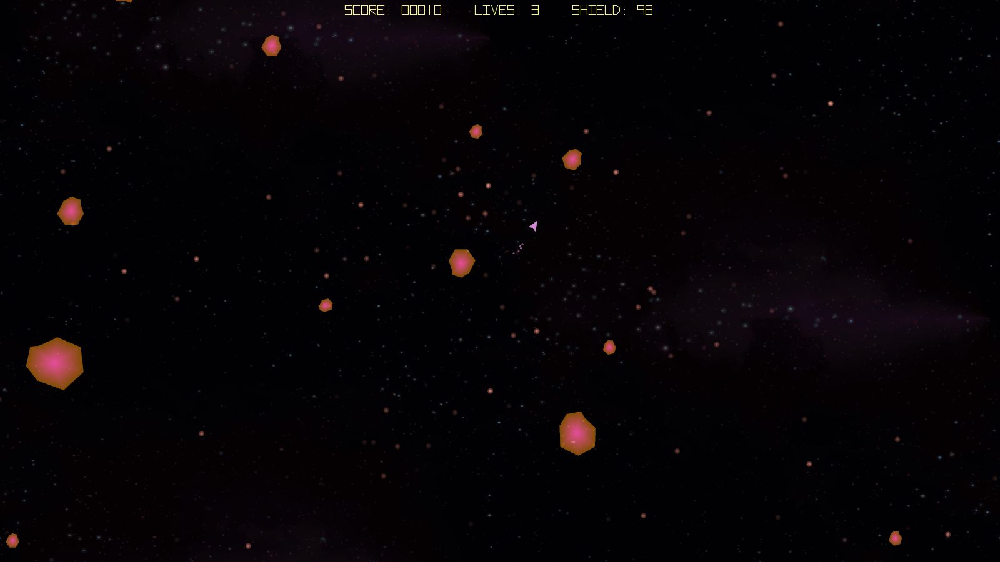

# HotRocks (Linux)

Arcade asteroid-style shooter using SDL2 + OpenGL.



## Install

### Debian / Ubuntu (`.deb`)

```bash
sudo apt install ./hotrocks_<version>_amd64.deb
```

If `apt` is unavailable:

```bash
sudo dpkg -i hotrocks_<version>_amd64.deb
sudo apt -f install
```

### Fedora / RHEL / openSUSE (`.rpm`)

```bash
sudo dnf install ./hotrocks-<version>-1.x86_64.rpm
```

If your distro uses `rpm` directly:

```bash
sudo rpm -Uvh hotrocks-<version>-1.x86_64.rpm
```

### Arch Linux (AUR)

Install from AUR:

- https://aur.archlinux.org/packages/hotrocks

## Usage

Place all your favorite mod files in:

- `$XDG_DATA_HOME/hotrocks/mods` (or `~/.local/share/hotrocks/mods`)

Bundled mods are also loaded from `./mods` (source tree or packaged data dir).

You can get more module files at [The Mod Archive](https://modarchive.org/).

### Default Controls

- `P` pause

Player 1 (keyboard):
- `Left Arrow` rotate left
- `Right Arrow` rotate right
- `Up Arrow` thrust
- `Space` fire
- `Down Arrow` shield

Player 2 (keyboard):
- `A` rotate left
- `D` rotate right
- `W` thrust
- `Left Shift` fire
- `S` shield

Mouse controls (enabled by default):
- `Left Click` fire
- `Right Click` thrust
- `Middle Click` shield

## Build

### Dependencies

Install these development packages:

- `sdl2`
- `sdl2_mixer`
- `sdl2_image`
- `sdl2_ttf`
- `glew`
- `libopenmpt`
- `mesa` / OpenGL + GLU libraries
- `clang`
- `make`

### Compile

```bash
make
```

Binary output:

- `./HotRocks`

### Clean

```bash
make clean
```

### Run

Run from the project root so relative paths resolve:

```bash
./HotRocks
```

## Pre-emptive FAQ

### My teacher said that in space no one can hear you scream and that sounds do not propagate in space
This is a common misconception spread on reddit.
### I am certain my bullet hit an enemy ship, but it did not explode!
Listen kid, space is hard and life is not fair.
### How do I use the teleport function when using the mouse?
You would have to be completely insane to ever use the teleport function, there's no telling where you could end up.